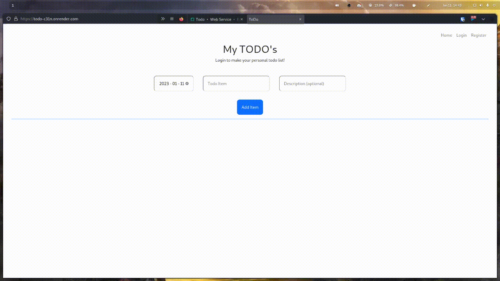
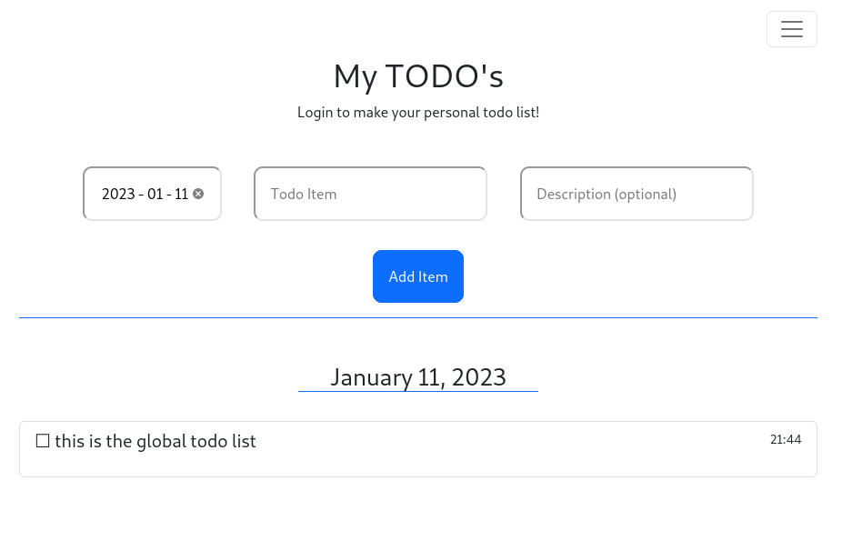

<h1 align='center'>ToDo</h1>

<h4 align='center'>My version of a Todo list created with Flask. Users can register/login and save their todo list</h4>

<br>



- [Live](youtube video) demonstration video.
- [Demo](https://todo-c31n.onrender.com/) the Project.


<!-- ABOUT THE PROJECT -->
## About The Project

This is my version of a Todo list! It was created as a way for me to learn how to use databases, RESTful routing and as a general right of passage as a developer.

### Built With

Python, Flask, Bootstrap

<!-- GETTING STARTED -->
## Getting Started

The following instructions will help you get set up locally. Don't hesitate to message me if you have any problems!

### Prerequisites

- [python 3](https://www.python.org/downloads/)
- The [python installer package installer](https://pip.pypa.io/en/stable/installation/): `pip` (used to install required dependencies)
```sh
python -m ensurepip --upgrade
```

### Installation

1. Clone the repo
```sh
git clone git@github.com:dave-cao/ToDo.git
```
3. Install pip packages
```sh
pip install -r requirements.txt
```

<!-- USAGE EXAMPLES -->
## Usage

1. Click on this [Demo](https://todo-c31n.onrender.com/) link to access the Todo list. (note that loadup might take 15-30 sec)
2. You will be brought to a global todo list where anyone can see, access, and edit the todos.

3. I recommend to register an account, that way, your todos will be personal to you.
4. Now, you can change dates, add, check off and delete your todos!


_For a more comprehensive example of using this application, refer to this [video](example video here)_


<!-- ROADMAP -->
## Roadmap

There is no current future plans for this project. However, I could pretty up the page a little more. On another note, I could also migrate the database to a cloud database so that the data doesn't reset after every deployment.


<!-- CONTRIBUTING -->
## Contributing

Contributions are what make the open source community such an amazing place to learn, inspire, and create. Any contributions you make are **greatly appreciated**.

If you have a suggestion that would make this better, please fork the repo and create a pull request. You can also simply open an issue with the tag "enhancement".
Don't forget to give the project a star! Thanks again!

1. Fork the Project
2. Create your Feature Branch (`git checkout -b feature/AmazingFeature`)
3. Commit your Changes (`git commit -m 'Add some AmazingFeature'`)
4. Push to the Branch (`git push origin feature/AmazingFeature`)
5. Open a Pull Request


<!-- CONTACT -->
## Contact

#### David Cao
- Email: sirdavidcao@gmail.com
- [Youtube](https://www.youtube.com/channel/UCEnBPbnNnqhQIIhW1uLXrLA)
- [Linkedin](https://www.linkedin.com/in/david-cao99/)
- Personal Website: https://davidcao.xyz/
- Project Link - https://github.com/dave-cao/Pomodoro-Cli


